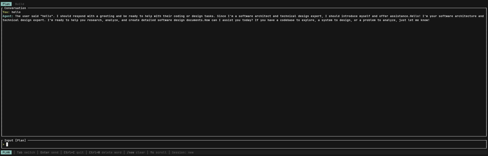

# zero-code-cli

[](LICENSE)
[](https://www.rust-lang.org/)
[](#)
[](#)
[])-success.svg)](#)

<p align="center">
  
</p>

> A concise, high-performance **terminal AI coding agent** written in safe Rust, powered by the **DeepSeek API**.

`zero-code-cli` brings an agentic coding workflow to your terminal: it can explore your codebase, plan a design, and write code on your behalf — all through a streaming TUI. It uses a **Plan → Build** dual-mode workflow so you can separate thinking from implementation, and ships with filesystem + shell tools the agent can call autonomously via a ReAct loop.

- ~3400 lines of Rust, **zero `unsafe` code** (`#![forbid(unsafe_code)]`)
- Single-threaded async runtime (tokio current-thread)
- Real-time token streaming rendered with [Ratatui](https://ratatui.rs/)
- Works with any **DeepSeek-compatible** OpenAI-style chat API

## Why zero-code-cli?

- **Small and readable.** The entire agent fits in ~3400 lines across 8 files — easy to audit, learn from, and hack on. No framework lock-in.
- **Plan / Build separation.** Research and design happen in Plan mode; switching to Build captures the plan as context so the coding agent inherits the full design.
- **Safe Rust.** `#![forbid(unsafe_code)]` means no unsafe blocks, anywhere.
- **Local-first sessions.** Conversations are saved per-project on your own machine under `~/.zero-code-cli/`.

## Features

- **Dual-mode workflow** — Plan mode for research and design thinking, Build mode for writing code. Switch with `Tab`.
- **Plan artifact handoff** — When you switch from Plan to Build, the plan conversation is captured and injected as context so the Build agent inherits the full design.
- **Session persistence** — Conversations are automatically saved per-project under `~/.zero-code-cli/memory/`. List and switch sessions with `/sessions`.
- **ReAct agent loop** — The agent reasons, calls tools, and iterates up to 10 turns per message.
- **API retry with exponential backoff** — Failed API calls are retried up to `retry_count` times with configurable delay.
- **Built-in tools** — `read_file`, `write_file` (both with partial read/write via line ranges), `bash` (with timeout enforcement), `grep`, `ls` — all defined with JSON Schema and accessible to the model.
- **Streaming TUI** — Real-time token streaming with blinking cursor indicator, rendered with [Ratatui](https://ratatui.rs/).
- **DeepSeek reasoning support** — Handles `reasoning_content` tokens from DeepSeek reasoning models (e.g. `deepseek-reasoner`).
- **Configurable** — API endpoint, model, temperature, max tokens, retry settings, and custom system prompt all set via `~/.zero-code-cli/config.toml`.
- **Debug logging** — Set `DEBUG=true` for detailed logs to `~/.zero-code-cli/debug.log`.
- **Cross-platform** — Runs on Windows, macOS, and Linux via [crossterm](https://github.com/crossterm-rs/crossterm).

## Requirements

- Rust toolchain (edition 2024)
- A [DeepSeek API key](https://platform.deepseek.com/)

## Installation

```bash
git clone https://github.com/gaoze1998/zero-code-cli.git
cd zero-code-cli
cargo build --release
```

The binary will be at `target/release/zero-code-cli` (or `target\release\zero-code-cli.exe` on Windows).

### Quick start

```bash
# 1. Configure your API key
mkdir -p ~/.zero-code-cli
cat > ~/.zero-code-cli/config.toml <<'EOF'
api_url = "https://api.deepseek.com"
api_key = "sk-your-key-here"
model = "deepseek-v4-flash"
max_tokens = 4096
temperature = 0.7
EOF

# 2. Run it from any project directory
cd your-project
zero-code-cli
```

On Windows PowerShell:

```powershell
New-Item -ItemType Directory -Force "$env:USERPROFILE\.zero-code-cli"
@'
api_url = "https://api.deepseek.com"
api_key = "sk-your-key-here"
model = "deepseek-v4-flash"
max_tokens = 4096
temperature = 0.7
'@ | Set-Content "$env:USERPROFILE\.zero-code-cli\config.toml"
```

## Configuration

Create `~/.zero-code-cli/config.toml`:

```toml
api_url = "https://api.deepseek.com"
api_key = "sk-your-key-here"
model = "deepseek-v4-flash"
max_tokens = 4096
temperature = 0.7
retry_count = 2
retry_delay_secs = 2
system_prompt = "You are a helpful coding assistant."
```

Environment variable overrides:

| Variable | Config key |
|---|---|
| `DEEPSEEK_API_KEY` | `api_key` |
| `DEEPSEEK_API_URL` | `api_url` |
| `DEEPSEEK_MODEL` | `model` |

> **Tip:** Because the client speaks the OpenAI-compatible chat completions format, you can point `api_url` at any compatible endpoint (e.g. a local proxy or other DeepSeek-compatible provider).

## Usage

```bash
cargo run
# or with debug logging
DEBUG=true cargo run
```

### Keybindings

| Key | Action |
|---|---|
| `Enter` | Send message (or handle slash command) |
| `Tab` | Switch Plan ↔ Build mode |
| `Ctrl+C` / `Ctrl+D` | Quit |
| `Ctrl+W` | Delete previous word |
| `Home` / `End` | Move to line start/end |
| `Up` / `Down` | Scroll conversation (1 line) |
| `PageUp` / `PageDown` | Scroll conversation (5 lines) |

### Slash Commands

| Command | Action |
|---|---|
| `/new` | Reset both Plan and Build conversations (auto-saves current session) |
| `/plan` | Switch to Plan mode |
| `/build` | Switch to Build mode (captures plan artifact) |
| `/sessions` | List all saved sessions for the current project |
| `/sessions <n>` | Switch to session number `n` (auto-saves current session first) |

### Sessions

Sessions are automatically saved per-project to `~/.zero-code-cli/memory/<project>/sessions/`. Each session file stores both Plan and Build conversation histories, the plan artifact, and the current mode.

- **Auto-save** — The current session is saved on quit (`Ctrl+C`/`Ctrl+D`), on `/new`, and before switching to another session.
- **Auto-name** — Session names are derived from the first user message in the conversation.
- **List & switch** — Use `/sessions` to see all saved sessions (most recent first), then `/sessions 1` to load session #1.

### Workflow

1. **Plan mode** (`/plan`) — Ask the agent to research, explore, and design a solution. The system prompt guides it toward analysis and design, not code writing.
2. **Switch** (`Tab`) — All agent messages from Plan are captured into a plan artifact.
3. **Build mode** (`/build`) — On your first message, the plan artifact is injected as context. The Build system prompt focuses the agent on implementation.
4. **Iterate** — Switch back to Plan anytime to refine the design, then back to Build to continue coding.

### Available Tools

The agent can call these tools on your filesystem:

- `read_file` — Read file contents, supports partial reads via `start_line`/`end_line` (1 MB limit)
- `write_file` — Write or overwrite a file, supports targeted edits via `start_line`/`end_line` (path traversal guarded)
- `bash` — Execute shell commands with configurable timeout (default 30s, max 120s)
- `grep` — Search files by regex (output truncated to 100 KB)
- `ls` — List directory contents

## Examples

See the [`examples/`](examples/) directory for projects built with zero-code-cli:

- **[tetris](examples/tetris/)** — Classic Tetris game (vanilla JS + HTML5 Canvas, SRS rotation, 7-bag randomizer, ghost piece), generated entirely by the agent.

## Architecture

```
src/
├── main.rs     Entry point, terminal setup, event loop, agent_loop(), key handling
├── app.rs      App state, dual message histories, plan artifact, slash commands
├── api.rs      DeepSeek API client, SSE streaming, tool-call parsing
├── ui.rs       Ratatui rendering: tabs, conversation, input, status bar
├── tools.rs    5 built-in tools with JSON Schema definitions
├── config.rs   Config loading from TOML + env var overrides
├── session.rs  Session persistence: save, load, list (JSON files per project)
└── logger.rs   Debug logging to file
```

**Data flow:** user types → `Enter` spawns `agent_loop()` as a tokio task → `api::stream_chat()` POSTs to the API → SSE tokens stream through an mpsc channel → main event loop drains them into `App` → `ui::draw()` re-renders at ~60fps. When the model responds with tool calls, `agent_loop()` executes them, feeds results back, and loops (max 10 iterations).

```
┌─────────────┐   Enter    ┌──────────────┐   SSE stream   ┌─────────────┐
│   Input box │ ─────────► │  agent_loop  │ ◄────────────► │ DeepSeek API│
└─────────────┘            └──────┬───────┘                └─────────────┘
        ▲                          │ tool calls
        │ render                   ▼
┌───────┴───────┐            ┌──────────────┐
│  ui::draw()   │ ◄───────── │   tools.rs   │  read/write/bash/grep/ls
└───────────────┘   events   └──────────────┘
```

## Roadmap

- [ ] `cargo install` distribution
- [ ] More tools (glob, multi-file edit, web fetch)
- [ ] Configurable max agent iterations
- [ ] Markdown / syntax-highlighted rendering in the TUI

## Contributing

Contributions are welcome! This project is intentionally small — please keep new code `unsafe`-free and within the existing module layout. Open an issue first to discuss larger changes.

## License

MIT — see [LICENSE](LICENSE).
